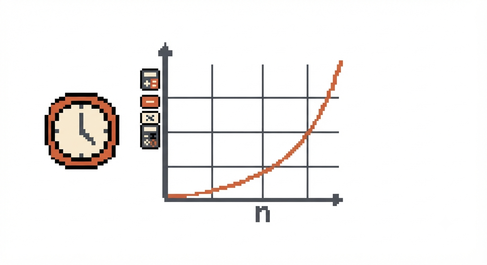
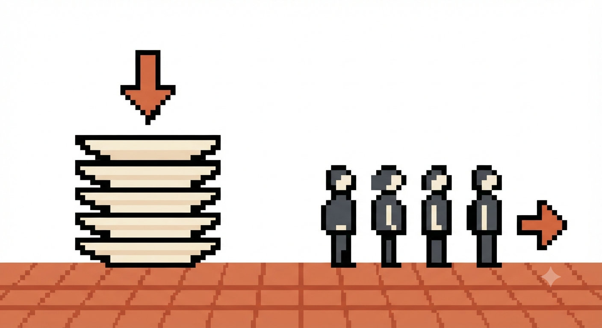
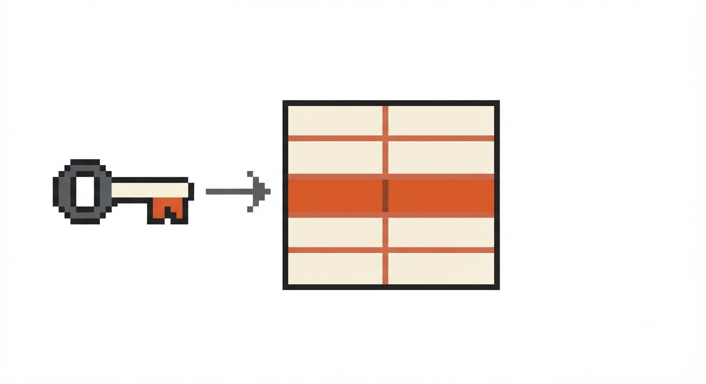
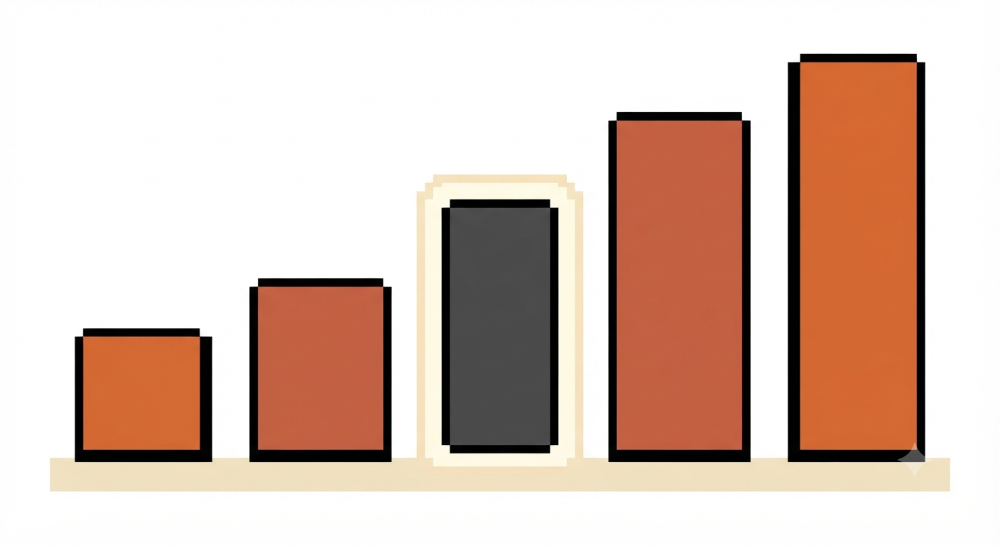
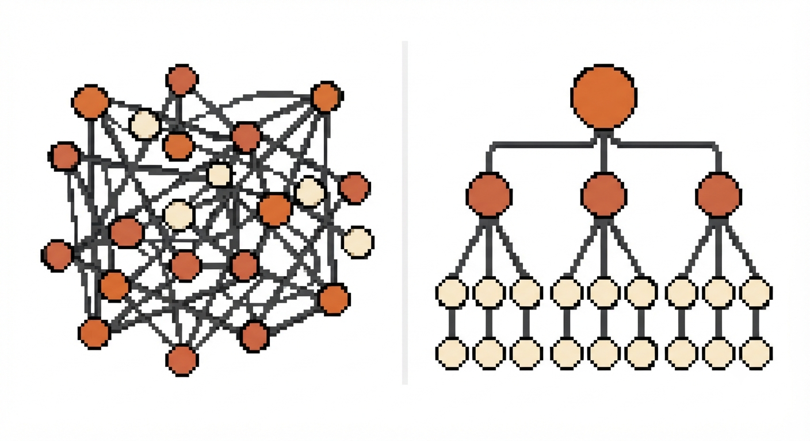
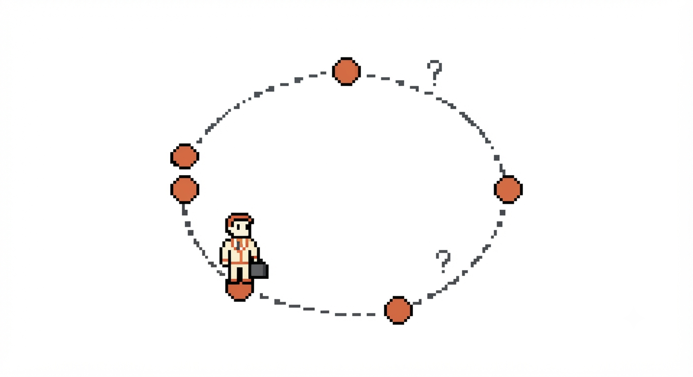

## My Take

One of the best books I have ever read, and I would recommend it to anyone who even thinks about programming one day. It does something most technical books fail at: it explains complex ideas through analogies that actually stick. The book builds logical thinking from the ground up, and that foundation applies to any area of tech you want to pursue — not just algorithms.

On a personal note: this book was also responsible for introducing me to coding exercises, which I genuinely took on as a hobby. Whenever I need to get my head working, that is where I go.

---

## What even is an algorithm?

An algorithm is just a set of instructions to accomplish a task. That's it. The interesting question is not what it does, but how efficiently it does it.

To talk about efficiency, we use Big O notation. It does not measure time in seconds — it measures how the number of operations grows as the input grows. Think of it as the shape of the curve, not a single point on it. Big O always considers the worst case: if you are looking for a name in a phone book, Big O assumes the name is on the very last page.

The most common complexities, from fastest to slowest:

| Notation | Name | Example |
|---|---|---|
| O(log n) | Logarithmic | Binary search |
| O(n) | Linear | Simple search |
| O(n log n) | Linearithmic | Quicksort |
| O(n²) | Quadratic | Selection sort |
| O(n!) | Factorial | Traveling salesman |

The difference matters at scale. Searching a list of a million items with O(n) means up to a million operations. With O(log n), it is around 20.

---

## Data structures

Before you can understand algorithms, you need to understand the structures they operate on. The book covers the essentials well.

Arrays and linked lists are the foundation. Arrays store elements in contiguous memory, making reads fast but insertions slow. Linked lists scatter elements in memory with each node pointing to the next — great for insertions, slower for lookups.

Stacks and queues are ordered collections with restricted access. A stack is last-in, first-out — like a pile of plates. A queue is first-in, first-out — like a line at a coffee shop. The call stack that recursion relies on is literally a stack.

Hash tables are one of the most useful data structures in practice. They map keys to values and deliver O(1) lookups on average. The book explains not just how to use them but what happens when two keys hash to the same slot — a collision — and the strategies to deal with it.

---

## Sorting

The book walks through multiple sorting algorithms, which is a good way to understand how the same problem can be approached with very different trade-offs.

Selection sort scans the entire list to find the smallest element, places it first, then repeats for the rest. Simple to understand, but O(n²) — it does not scale.

Quicksort is built on divide and conquer: pick a pivot, put everything smaller on the left and everything bigger on the right, then repeat recursively for each side. It runs at O(n log n) on average and is one of the most widely used sorting algorithms in practice.

---

## Recursion

Recursion is when a function calls itself. Every recursive function has exactly two parts: the recursive case and the base case (where it stops). Without a base case, it runs forever and crashes.

Every call gets added to the call stack, consuming memory. This is why recursion is not always the right tool for performance-sensitive code. A quote from the book that sums it up:

> "Loops may achieve a performance gain for your program. Recursion may achieve a performance gain for your programmer."

---

## Graphs and trees

One of the more conceptually interesting parts introduces graphs — a way to model relationships between things. A graph is made up of nodes and edges, which can be directional or bidirectional and carry weights representing cost or distance.

A tree is a specific type of graph: connected, with no cycles, and with a clear hierarchical structure. Every tree is a graph, but not every graph is a tree. The distinction matters when choosing which algorithm to apply.

---

## NP-complete problems

Some problems have no known efficient solution. The traveling salesman — where a salesman must visit a set of cities covering the shortest possible total distance — is one of the most famous examples. The number of possible routes grows at O(n!), which becomes computationally impossible even for a relatively small number of cities.

The book uses it to introduce the concept of NP-complete problems: a class of problems that are easy to verify but believed to be impossible to solve efficiently. Recognizing when you are facing one of them is itself a valuable skill — it tells you to stop looking for the perfect algorithm and start thinking about good approximations instead.
