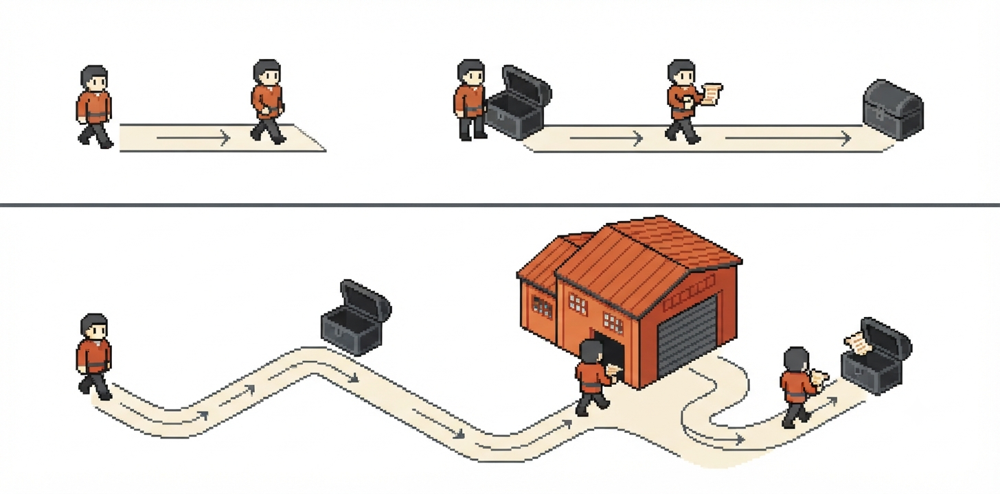
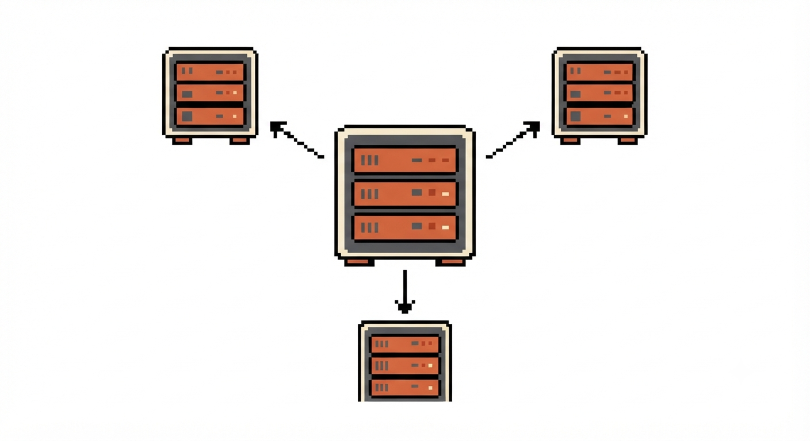

## Overview

Scaling reads in a database means reducing the load and latency of `SELECT` operations without sacrificing more consistency than necessary. The five strategies most used in the industry are: **indexes**, **connection pooling**, **CDN**, **cache**, and **read replicas**. Each one attacks a different bottleneck and comes with its own trade-off.

## Comparison table

| Strategy | Problem it solves | Where it acts | Main trade-off |
|---|---|---|---|
| Indexes | Full table scan (O(n)) on lookups | Inside the database, on the table | Slower writes + extra disk space |
| Connection Pooling | Cost of opening/closing a TCP connection on every request | Between the application and the database | A poorly sized pool causes queuing or overload |
| CDN | Physical distance between server and end user | Network edge, outside the database | Doesn't help with dynamic/personalized data |
| Cache | Recomputing/rereading expensive or hot data | Layer between app and database | Risk of serving stale data (invalidation) |
| Read Replicas | Primary database overloaded with reads | Read-only copies of the database | Replication lag (eventual consistency) |

---

## 1. Indexes

An auxiliary data structure (usually a B-Tree) that organizes a column's values in order, enabling lookups in O(log n) instead of O(n). It's like using a dictionary: instead of reading word by word, you jump straight to the starting letter.

**Trade-off:** every write (`INSERT`/`UPDATE`/`DELETE`) also has to update the associated indexes, making writes slower. Each index also takes up additional disk space.

---

## 2. Connection Pooling

Keeps a set of connections already open with the database and reuses them across requests, avoiding the cost of opening a new connection (TCP handshake, authentication, memory allocation) every time. It also protects the database from exceeding its concurrent connection limit.

It can happen at two layers:

- **Application-side:** the pool lives inside the process itself (each instance has its own).
- **External (proxy):** a dedicated service (e.g. PgBouncer) sitting between the app and the database, multiplexing many virtual connections into a few real ones.

### Pooling modes (the waiter analogy)

| Mode | Analogy | Behavior | Trade-off |
|---|---|---|---|
| Session pooling | The waiter stays at the same table from start to finish | Connection tied to the client until it disconnects | Simple and safe, but wastes idle connections |
| Transaction pooling | The waiter switches after each order, not each dish | Connection returned to the pool as soon as the transaction ends | Most common; breaks persistent-session features (`PREPARE`, `SET`) |
| Statement pooling | The waiter switches after every single dish | Connection returned after each statement | Most aggressive; breaks multi-statement transactions |

---

## 3. CDN (Content Delivery Network)

A global network of geographically distributed servers that delivers content from the point closest to the end user, reducing network latency. It's the simplest of the five solutions because it acts outside the database, at the edge of content delivery (typically for static files, images, assets).

**Trade-off:** it does nothing for dynamic or per-user personalized data, which still needs to be generated or fetched in real time.

---

## 4. Cache

An intermediate layer between the application and the database that stores a ready copy of some data, avoiding another trip to the database. Mainly used in two scenarios:

- **Hotspots:** data that receives far more reads than average (e.g. a celebrity's profile on a social network).
- **Expensive lookups:** queries with heavy aggregations or over huge tables.

**Flow:** the request comes in and first checks the cache. If the data is there and valid, it's returned directly. If not (or if it's invalid), the database is queried, the fresh version is stored in the cache, and only then is it returned to the client.

### Invalidation strategies

| Strategy | How it works | Trade-off |
|---|---|---|
| Expiration (TTL) | The cached data expires after a set time | Risk of serving stale data until expiration |
| Delete on update | The cache is cleared whenever the underlying data changes | Simple, but causes more database round-trips right after deletion |
| Write-through | The cache is updated together with the database write | Requires tight synchronization; higher risk of inconsistency if something fails midway |

---

## 5. Read Replicas

Works like a load balancer for the database. There's a primary database that receives all writes, and one or more copies (replicas) that receive the reads, taking that load off the primary.

**Trade-off:** synchronization between the primary and its replicas isn't instantaneous — it can take anywhere from milliseconds to seconds to replicate. Depending on which replica serves a given request, the user may receive stale data (eventual consistency instead of strong consistency).

---

## When to use each one

These strategies aren't mutually exclusive — systems at scale typically combine several at once. Indexes and connection pooling tend to be the baseline (they're almost always worth it). CDN comes in when there's static or lightly personalized content. Cache comes in when there are specific hotspots or expensive queries. Read replicas come in once read volume no longer fits on a single database, even with indexes and caching well configured.
